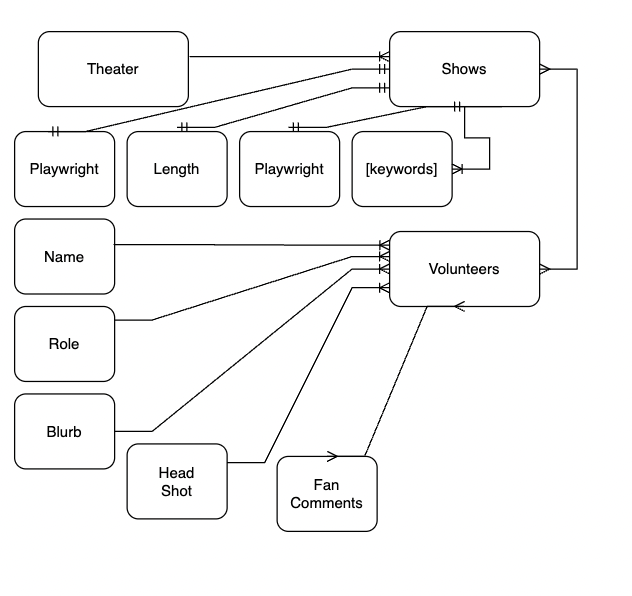
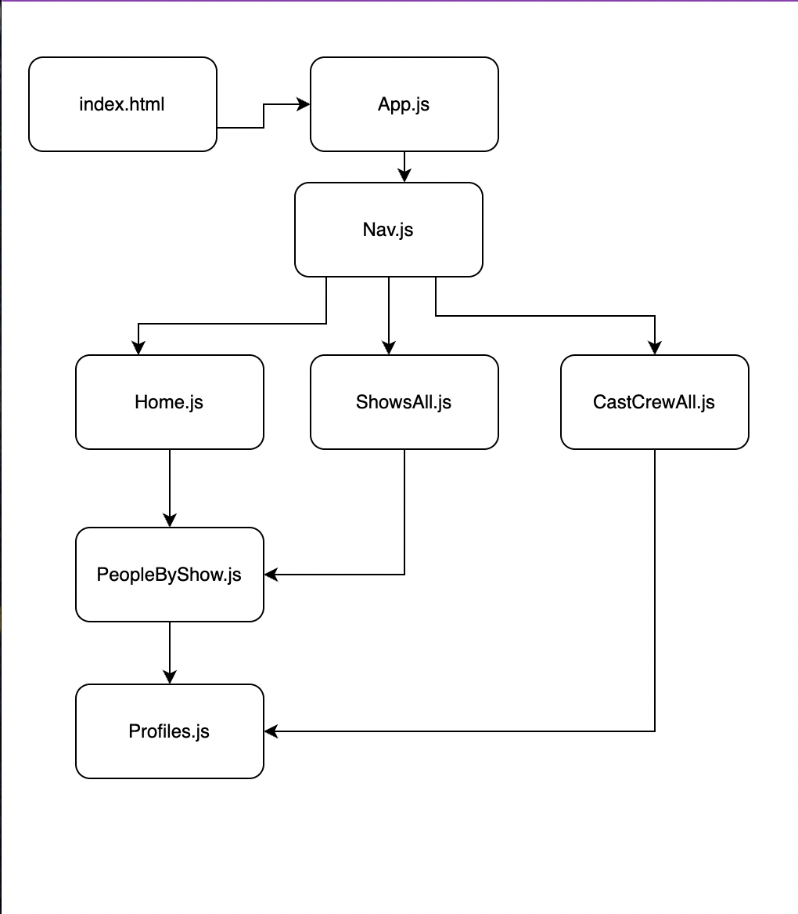

# Break A Leg

## Date: 7/25/2022

---

### By: Joshua Langner

---

| [LinkedIn](https://www.linkedin.com/in/josh-langner-48) | [GitHub](https://github.com/jlangner87) | [Portfolio](https://joshua-langner.com)

---

#### Hosted Site
*This project is currently not hosted due to the loss of free hosting services. As on 03/20/2023, I am searching for free or inexpensive hosting options for a MERN stack application*

To view this application on a localhost:
- Fork and clone this repository
- npm install
- npm start dev
- npm run start

---

### **_Description_**

#### This application connects community theater-goers to the cast and crew of the current production. Theater admin can easily create, update, and delete show and volunteer profiles for the public to read.

#### The two Mongoose components: Shows & Volunteers

---

### **_Technologies Used_**

- JavaScript
- CSS
- HTML
- React.JS
- Express
- MongoDB
- Mongoose

---

### **_ERD_**

#### 

### **_Component Hierarchy Diagram_**

#### 

### **_Screenshots_**

#### Home Page

#### 

#### Volunteer Page

#### 

#### Admin Forms Page

#### 

---

### _Credits & Citations_

##### .then vs async/await [StackOverflow](https://stackoverflow.com/questions/54495711/async-await-vs-then-which-is-the-best-for-performance)

##### Additional learning on Express routes [Express](https://expressjs.com/en/starter/basic-routing.html)

##### eadshot images [JCPenney](https://jcpportraits.com/business-headshot/)

##### "Murder on the Orient Express" Poster [Concert_Poster](https://concertposter.org/wp-content/uploads/2020/08/GypsyBetteMidler-rop.jpg)

##### Gypsy[Concert_Poster](https://concertposter.org/wp-content/uploads/2020/08/GypsyBetteMidler-rop.jpg)

##### "Beauty and the Beast" Poster [WikiMedia](https://upload.wikimedia.org/wikipedia/en/1/10/Beauty_and_the_Beast_%28cover_art%29_%E2%80%93_The_Broadway_Musical.jpg)

##### "Aladdin" Poster[PlayBill_Store](https://www.playbillstore.com/resize/Shared/Images/Product/Aladdin-the-Musical-Broadway-Poster/Aladdin_windowcard_14x22-1.jpg?bw=1000&w=1000&bh=1000&h=1000)

##### "Dracula" Poster [DC_Casset](https://dcassetcdn.com/design_img/3563506/688104/688104_19526344_3563506_3c0df975_image.jpg)

##### "Clue the Musical" Poster [SRHS_News](https://srhsnews.com/wp-content/uploads/2019/05/bl-clue-poster.jpg)
