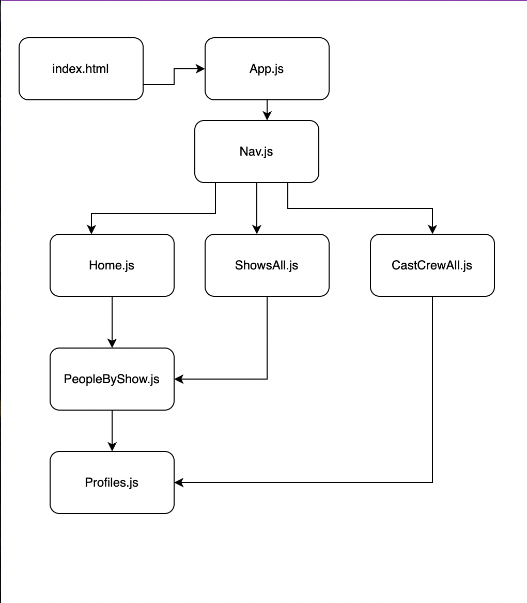
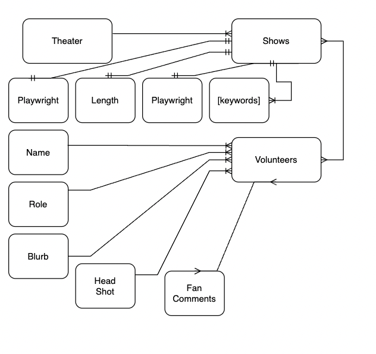
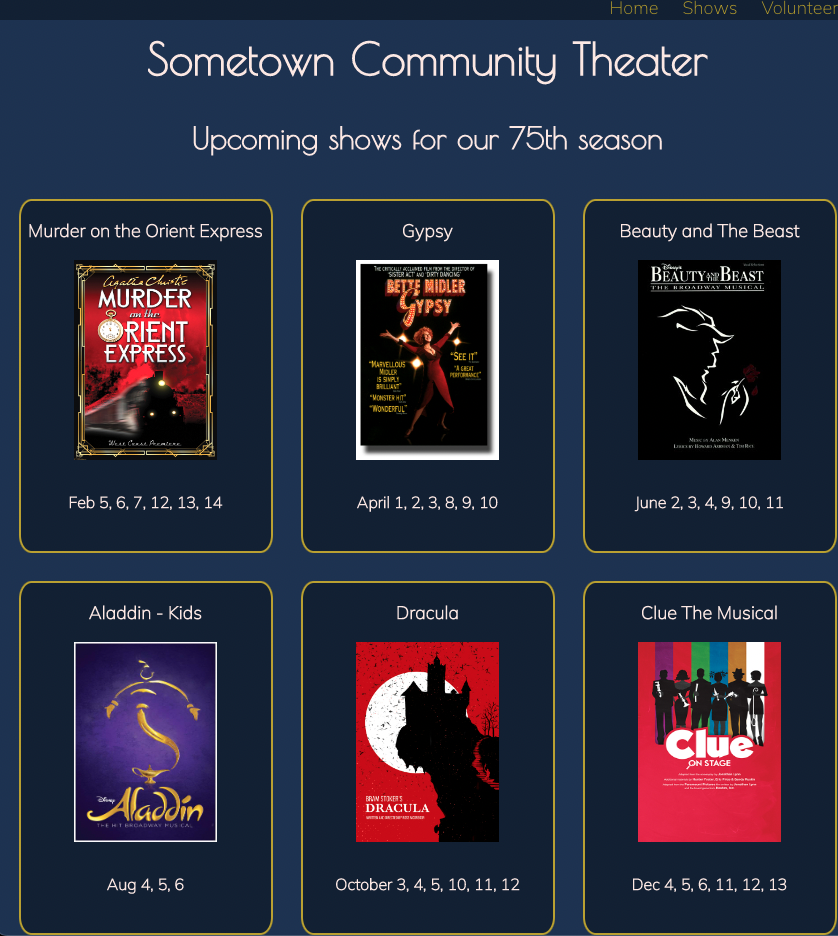
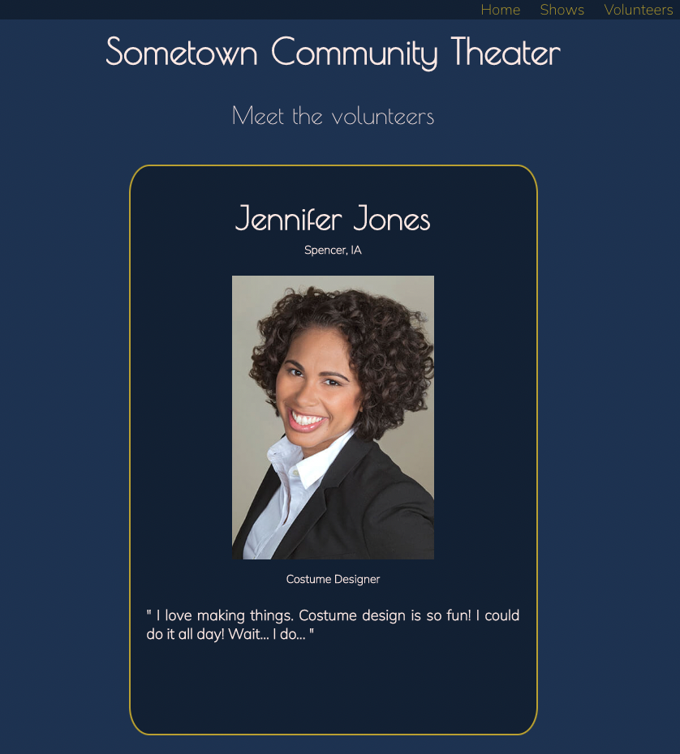
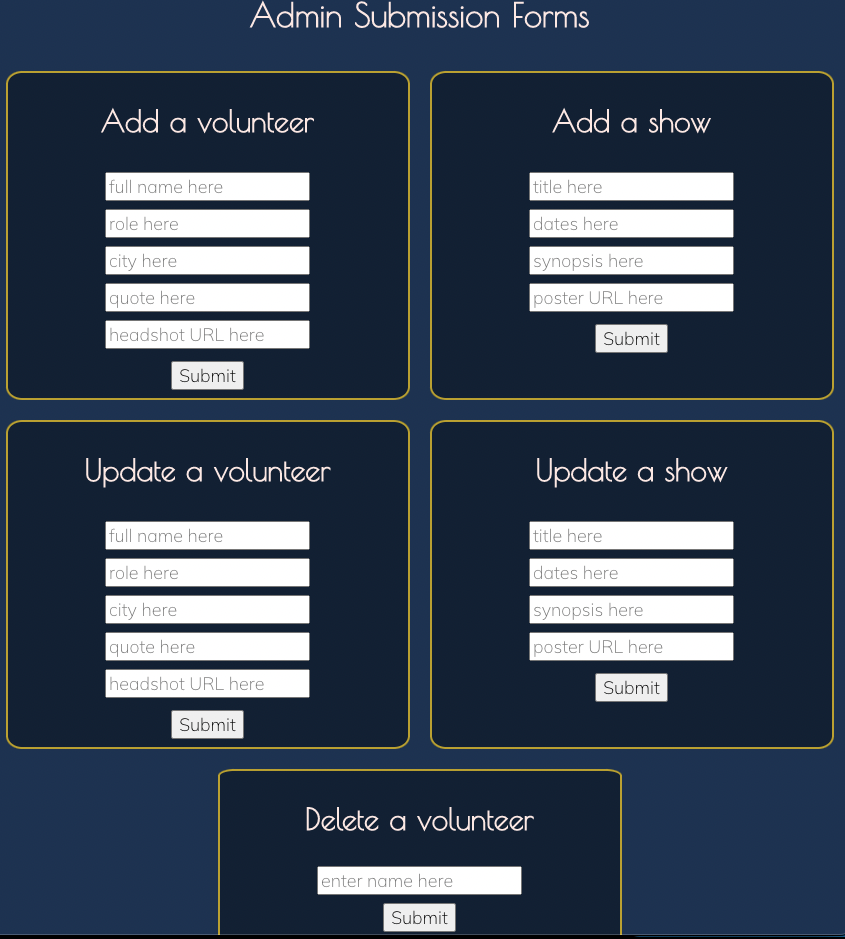

# Break A Leg

## Date: 7/25/2022

---

### By: Joshua Langner

---

| [LinkedIn](https://www.linkedin.com/in/josh-langner-48) | [GitHub](https://github.com/jlangner87) |

---

Hosted Site

---

## **_Description_**

### This application connects community theater-goers to the cast and crew of the current production. The theater creates information for each show (Title, production dates, length, and a cast/crew list) and a profile for each member of the show (volunteer photo, name, role, previous roles, and a short blurb from the volunteer).

### The home page will have a list of this seson's shows. The name and role of each volunteer will be displayed on the show's page. When a user clicks on the name, it will open up to a page that displays the rest of the profile information.

### The two Mongoose components: Shows & Volunteers

---

## **Future Development Opportunity (Post MVP)**

### Under the display of each volunteer's profile, there will be a compiled biography of every role they have had in any show for the theater using the app. Under that will be a field where users can enter their name and a short message to the volunteer. When they submit it, the message will be displayed on their profile.

### The post, update, and delete page for shows and volunteers will be hidden behind an authentication wall, so that the general public cannot alter the data bases.

---

## **_Trello Board_**

[Trello](https://trello.com/invite/b/4PqpHSkZ/8c35f8b876eae832e5ee083fb5e78a40/full-stack-mern-application)

---

## **_Technologies Used_**

- JavaScript
- CSS
- HTML
- React.JS
- Express
- MongoDB
- Mongoose

---

## **_Screenshots_**

### Component Hierarchy Diagram

### Entity Relationship Diagram

### Home Page

### Volunteer Page

### Admin Forms Page

## 

#### _Credits & Citations_

### .then vs async/await [StackOverflow](https://stackoverflow.com/questions/54495711/async-await-vs-then-which-is-the-best-for-performance)

### Additional learning on Express routes [Express](https://expressjs.com/en/starter/basic-routing.html)

### eadshot images [JCPenney](https://jcpportraits.com/business-headshot/)

### Thing to cite [Title](URL)

### Thing to cite [Title](URL)
